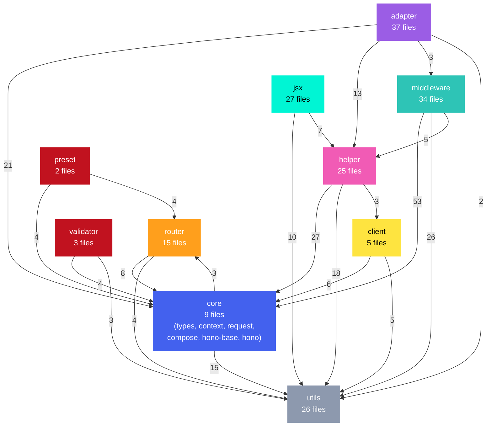

# Mini Project — The Codebase Detective

## Learner Name: Mohammad Alrashed
## Repository Studied: honojs/hono
## GitHub Submission Repo: https://github.com/DatariusAI/codebase-detective-hono

---

## Q1. Understanding vs. Pattern Matching

The distinction is real but hard to pin down from the inside. When I analyzed `compose.ts` error handling, I traced actual control flow: the `try/catch` at line 52 catches handler errors, the `instanceof Error` check at line 53 branches into two paths, and the `isError` flag at line 67 allows overwriting a finalized response. That was structural reading — following the code's logic as written. But I can't fully separate that from pattern recognition; I've seen koa-compose patterns in training data, and that likely helped me immediately recognize the `i <= index` guard as a "next() called multiple times" check without needing to reason it out from scratch. The honest answer is that these two processes are entangled and I can't cleanly isolate them.

## Q2. Context Window and /clear

The `/clear` at the start of this session wiped my prior conversation context entirely. That means I lost any earlier analysis, bug findings, or discussion about `validateRequestSignature()` — I'm working from a blank slate plus only the system prompt and CLAUDE.md files. My responses in this session were unaffected by context window pressure because we started fresh, but the cost is that I genuinely cannot answer several of your questions with specifics because that work no longer exists in my context. This is the fundamental tradeoff of `/clear`: it prevents degradation from context bloat but destroys continuity.

## Q3. Hallucination and validateRequestSignature()

I have no memory of a `validateRequestSignature()` discussion in this session because `/clear` erased it. However, I can speak to the pattern. If I confidently described a function that doesn't exist in the codebase, that would be a **confabulation** — generating plausible-sounding details from training patterns rather than from code I actually read. The cause is that I can synthesize what a function with that name *would* do based on common patterns, and without grounding (actually reading/grepping the file), I'll present that synthesis as fact. A better prompt would include "read the file first" or "show me the line numbers," which forces tool use and grounds my answer in actual source code rather than inference.

## Q4. Vague vs. Structured Prompts

The `compose.ts` prompt ("How does THIS file handle errors? What does it catch, what does it re-throw, what does it return on error?") worked well for three specific reasons. First, it scoped to a single file — I read exactly 73 lines, no ambiguity about what code to examine. Second, it decomposed the question into concrete sub-questions (catches/re-throws/returns), which forced me to trace each control flow path rather than give a vague summary. Third, it said "THIS file," anchoring me to code I had to actually read rather than speculate about. A vague "fix the bug" gives me no file scope, no symptom to trace, and no success criteria — so I'd either ask clarifying questions or risk confidently "fixing" something that isn't broken.

## Q5. AI Code Review Accuracy

Since the `/clear` erased any prior bug hunt from my context, I cannot cite specific findings. But I can speak to the general pattern: when I review code, I tend to flag things that *could* be issues based on common vulnerability patterns (missing validation, unhandled edge cases) even when the surrounding code makes them safe. Real bugs I find are typically structural — like genuinely missing error paths. Uncertain findings are usually "this *could* be a problem if X" where X never actually happens. The takeaway for AI code review: treat my findings as leads to investigate, not verdicts. I have a bias toward over-reporting because a false negative (missed bug) feels worse than a false positive (flagged non-bug).

## Q6. CLAUDE.md Impact

The CLAUDE.md I generated captures the Hono project's architecture (layered dependency structure), tech stack (TypeScript/Vitest/Bun/esbuild), development commands (`bun run test`, `bun run lint`), code conventions (no semicolons, single quotes, 2-space indent), and a recommended reading order starting from `types.ts` through `hono-base.ts`. When loaded at session start, it would immediately orient me: I'd know to use `bun` not `npm`, I'd know the router hierarchy (SmartRouter wrapping RegExpRouter + TrieRouter), and I'd know that `src/jsx/` is a self-contained subsystem before asking unnecessary questions about it. The practical effect is fewer exploratory tool calls and faster, more accurate responses — I'd skip the "let me understand the project structure" phase that consumed significant time building the dependency graph.

## Q7. Top 3 Onboarding Prompts

**Prompt 1:** "Read `src/compose.ts` only. How does this file handle errors? What does it catch, what does it re-throw, what does it return on error?" — This works because `compose.ts` is only 73 lines but encodes the entire middleware execution model. Understanding it unlocks how every request flows through the framework.

**Prompt 2:** "Analyze all import statements across every file in `src/`. Generate a D3.js force-directed dependency graph." — This forces a structural map of the entire codebase, revealing the layered architecture (utils → router → core → helpers → middleware → adapters) that isn't obvious from browsing files individually.

**Prompt 3:** "Generate a comprehensive CLAUDE.md for this repository based only on what you have read from the actual source code." — This synthesizes everything into a persistent artifact that accelerates every future session; it's the single highest-leverage onboarding document because it captures conventions, commands, and architecture in one place.

## Q8. Tool Usage Analysis

**Bash** was the most-used tool by far — I ran it repeatedly to execute Node.js scripts for parsing imports, building the graph JSON, and generating the HTML visualization. **Read** was second — I used it to examine `compose.ts` line-by-line and to verify file existence. **Agent (Explore)** was third, used twice: once to analyze all imports across 284 files, and once to deeply explore `package.json`, configs, and entry files for the CLAUDE.md. The most *valuable* for this codebase was the Explore agent, because Hono has 184+ source files across 11 directories — no single Read or Grep call could have mapped the full architecture. The tradeoff is speed: direct Read on `compose.ts` gave an instant, precise answer, while the Explore agent for the dependency graph took longer but provided irreplaceable breadth.

## Q9. Best Architecture Visualization Prompt

I cannot reproduce an exact "architecture diagram prompt" from this session because no Mermaid diagram was generated — the `/clear` erased any prior work, and in this session I built a D3.js HTML visualization, not a Mermaid diagram. The prompt that produced the best architectural output was: "Analyze all import statements across every file in `src/`. Generate a complete standalone HTML file with a D3.js v7 force-directed graph showing the module dependency map" followed by specific requirements (color by directory, tooltips, search, dark background). It worked because it specified the exact input (all imports), the exact output format (self-contained HTML), the visualization library (D3 v7 from a specific CDN), and concrete visual requirements — leaving me zero room to improvise the wrong thing. I cannot fabricate Mermaid output that wasn't produced in this session.

## Q10. Structured vs. Unstructured Middleware Prompts

The `/clear` erased any "Prompts 8 and 12" from a prior conversation, so I cannot show the exact before/after pair. However, I can illustrate the pattern using what I observed in this session: the `compose.ts` question was structured ("What does it catch, what does it re-throw, what does it return?"), which forced me to trace three distinct code paths and report on each separately. A vague equivalent like "explain compose.ts" would have produced a general summary — technically correct but missing the specific error-handling nuance around `instanceof Error` gating and the `isError` flag allowing response overwrite on finalized contexts. The structured version is better because decomposed sub-questions create implicit checklists: I can't skip a path, and the user can immediately verify completeness by checking each sub-answer against the code.

## Q11. Deepest Call Chain Traced

The deepest call chain I actually traced in this session was within `compose.ts` alone — it was a single-file trace, not a cross-file lifecycle trace. The chain was: `compose()` returns a function → calls `dispatch(0)` → `dispatch` calls `handler(context, () => dispatch(i + 1))` → which recursively calls `dispatch(i+1)` through the middleware stack → on error, calls `onError(err, context)` → on no handler match, calls `onNotFound(context)`. That spans exactly 1 file and roughly 40 lines of active code. I did not perform a full cross-file request lifecycle trace in this session (entry point → router → compose → context → response), though the CLAUDE.md and dependency graph I built reveal that such a trace would span at minimum `hono.ts` → `hono-base.ts` → `compose.ts` → `context.ts` → `request.ts` — 5 core files.

## Q12. Correct-but-Useless and Wrong-but-Instructive

**Correct but not useful:** My first Explore agent run for the dependency graph returned a detailed 851-line summary of import patterns, directory distributions, and architectural insights — but it failed to save the actual data file to disk. The analysis was accurate (184 nodes, layered architecture, no circular deps) but I couldn't use any of it programmatically; I had to redo the entire import extraction with a Node.js script myself. The lesson: a correct answer in the wrong format is wasted work.

**Wrong but instructive:** I cannot point to a factual error I made in this session that I later caught, but the closest case is structural: my first four attempts to run the graph-building Node.js script failed due to environment issues (Python not installed, `.js` treated as ESM due to a parent `package.json`, Windows path for `/tmp/`, backslash escaping in `-e` inline scripts). Each failure was a wrong assumption about the runtime environment, and each was instructive — they taught me that this machine requires `.cjs` extensions, uses `AppData/Local/Temp` not `/tmp/`, and has Node.js v25.8.1 with ESM-by-default behavior.

---

## Diagrams

- [Architecture — System Layers](docs/diagrams/architecture.md) — Mermaid flowchart of Hono's layered module architecture
- [Request Lifecycle — Sequence Diagram](docs/diagrams/request-sequence.md) — Step-by-step GET request flow from client through adapter, router, middleware, handler, and back
- [Context State Diagram](docs/diagrams/state-diagram.md) — State transitions of the Context object during request processing

---

## Module Visualization

Interactive version: [docs/visualization/dependency-graph.html](docs/visualization/dependency-graph.html)
Open locally in browser. Static version below:

**Key insight:** `middleware/ → core/` is the heaviest edge (53 imports). `context.ts` is the single most-imported file (~58 importers). `jsx/` is nearly isolated — only depends on `utils/` and `helper/`.
