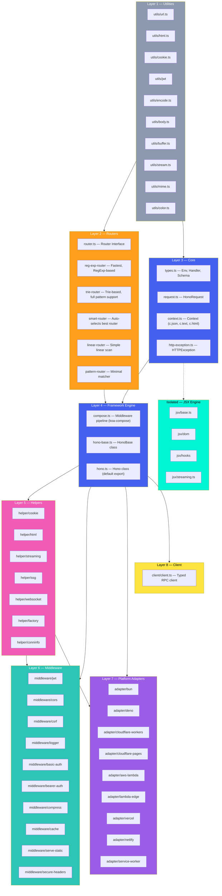

# Hono Architecture — System Layers

```mermaid
flowchart TB
    subgraph Layer1["Layer 1 — Utilities"]
        utils/url.ts
        utils/html.ts
        utils/cookie.ts
        utils/jwt
        utils/encode.ts
        utils/body.ts
        utils/buffer.ts
        utils/stream.ts
        utils/mime.ts
        utils/color.ts
    end

    subgraph Layer2["Layer 2 — Routers"]
        router.ts["router.ts — Router Interface"]
        RegExpRouter["reg-exp-router — Fastest, RegExp-based"]
        TrieRouter["trie-router — Trie-based, full pattern support"]
        SmartRouter["smart-router — Auto-selects best router"]
        LinearRouter["linear-router — Simple linear scan"]
        PatternRouter["pattern-router — Minimal matcher"]
    end

    subgraph Layer3["Layer 3 — Core"]
        types.ts["types.ts — Env, Handler, Schema"]
        request.ts["request.ts — HonoRequest"]
        context.ts["context.ts — Context (c.json, c.text, c.html)"]
        http-exception.ts["http-exception.ts — HTTPException"]
    end

    subgraph Layer4["Layer 4 — Framework Engine"]
        compose.ts["compose.ts — Middleware pipeline (koa-compose)"]
        hono-base.ts["hono-base.ts — HonoBase class"]
        hono.ts["hono.ts — Hono class (default export)"]
    end

    subgraph Layer5["Layer 5 — Helpers"]
        cookie["helper/cookie"]
        html["helper/html"]
        streaming["helper/streaming"]
        ssg["helper/ssg"]
        websocket["helper/websocket"]
        factory["helper/factory"]
        conninfo["helper/conninfo"]
    end

    subgraph Layer6["Layer 6 — Middleware"]
        jwt["middleware/jwt"]
        cors["middleware/cors"]
        csrf["middleware/csrf"]
        logger["middleware/logger"]
        basicAuth["middleware/basic-auth"]
        bearerAuth["middleware/bearer-auth"]
        compress["middleware/compress"]
        cache["middleware/cache"]
        serveStatic["middleware/serve-static"]
        secureHeaders["middleware/secure-headers"]
    end

    subgraph Layer7["Layer 7 — Platform Adapters"]
        bun["adapter/bun"]
        deno["adapter/deno"]
        cfWorkers["adapter/cloudflare-workers"]
        cfPages["adapter/cloudflare-pages"]
        awsLambda["adapter/aws-lambda"]
        lambdaEdge["adapter/lambda-edge"]
        vercel["adapter/vercel"]
        netlify["adapter/netlify"]
        serviceWorker["adapter/service-worker"]
    end

    subgraph Layer8["Layer 8 — Client"]
        client.ts["client/client.ts — Typed RPC client"]
    end

    subgraph Isolated["Isolated — JSX Engine"]
        jsx/base.ts
        jsx/dom
        jsx/hooks
        jsx/streaming.ts
    end

    Layer1 --> Layer2
    Layer1 --> Layer3
    Layer2 --> Layer4
    Layer3 --> Layer4
    Layer4 --> Layer5
    Layer4 --> Layer6
    Layer5 --> Layer6
    Layer4 --> Layer7
    Layer5 --> Layer7
    Layer4 --> Layer8
    Layer3 -.-> Isolated

    style Layer1 fill:#8d99ae,color:#fff
    style Layer2 fill:#ff9f1c,color:#fff
    style Layer3 fill:#4361ee,color:#fff
    style Layer4 fill:#4361ee,color:#fff
    style Layer5 fill:#f15bb5,color:#fff
    style Layer6 fill:#2ec4b6,color:#fff
    style Layer7 fill:#9b5de5,color:#fff
    style Layer8 fill:#fee440,color:#000
    style Isolated fill:#00f5d4,color:#000
```
