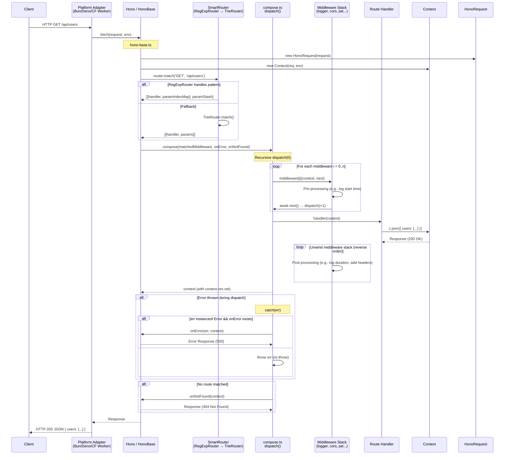

# GET Request Lifecycle — Sequence Diagram

```mermaid
sequenceDiagram
    participant Client
    participant Adapter as Platform Adapter<br/>(Bun/Deno/CF Worker)
    participant Hono as Hono / HonoBase
    participant Router as SmartRouter<br/>(RegExpRouter → TrieRouter)
    participant Compose as compose.ts<br/>dispatch()
    participant MW as Middleware Stack<br/>(logger, cors, jwt...)
    participant Handler as Route Handler
    participant Ctx as Context
    participant Req as HonoRequest

    Client->>Adapter: HTTP GET /api/users
    Adapter->>Hono: fetch(request, env)

    Note over Hono: hono-base.ts#fetch()

    Hono->>Req: new HonoRequest(request)
    Hono->>Ctx: new Context(req, env)
    Hono->>Router: router.match('GET', '/api/users')

    alt RegExpRouter handles pattern
        Router-->>Hono: [[handler, paramIndexMap], paramStash]
    else Fallback
        Router->>Router: TrieRouter.match()
        Router-->>Hono: [[handler, params]]
    end

    Hono->>Compose: compose(matchedMiddleware, onError, onNotFound)

    Note over Compose: Recursive dispatch(0)

    loop For each middleware i = 0..n
        Compose->>MW: middleware[i](context, next)
        MW->>MW: Pre-processing (e.g., log start time)
        MW->>Compose: await next() → dispatch(i+1)
    end

    Compose->>Handler: handler(context)
    Handler->>Ctx: c.json({ users: [...] })
    Ctx-->>Handler: Response (200 OK)

    loop Unwind middleware stack (reverse order)
        MW->>MW: Post-processing (e.g., log duration, add headers)
    end

    Compose-->>Hono: context (with context.res set)

    alt Error thrown during dispatch
        Note over Compose: catch(err)
        alt err instanceof Error && onError exists
            Compose->>Hono: onError(err, context)
            Hono-->>Compose: Error Response (500)
        else
            Compose->>Compose: throw err (re-throw)
        end
    end

    alt No route matched
        Compose->>Hono: onNotFound(context)
        Hono-->>Compose: Response (404 Not Found)
    end

    Hono-->>Adapter: Response
    Adapter-->>Client: HTTP 200 JSON { users: [...] }
```
