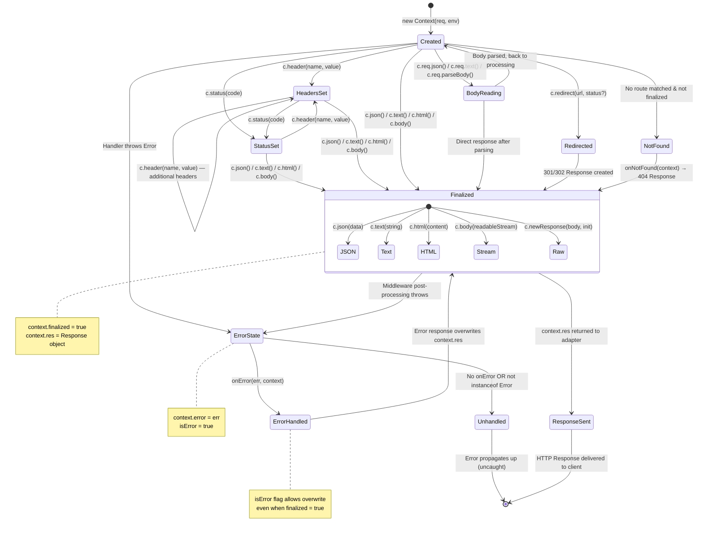

# Context Object — State Diagram

```mermaid
stateDiagram-v2
    [*] --> Created: new Context(req, env)

    Created --> HeadersSet: c.header(name, value)
    Created --> StatusSet: c.status(code)
    Created --> BodyReading: c.req.json() / c.req.text() / c.req.parseBody()

    HeadersSet --> HeadersSet: c.header(name, value) — additional headers
    HeadersSet --> StatusSet: c.status(code)

    StatusSet --> HeadersSet: c.header(name, value)
    StatusSet --> Finalized: c.json() / c.text() / c.html() / c.body()

    HeadersSet --> Finalized: c.json() / c.text() / c.html() / c.body()
    Created --> Finalized: c.json() / c.text() / c.html() / c.body()

    BodyReading --> Created: Body parsed, back to processing
    BodyReading --> Finalized: Direct response after parsing

    Finalized --> ResponseSent: context.res returned to adapter
    note right of Finalized
        context.finalized = true
        context.res = Response object
    end note

    Created --> Redirected: c.redirect(url, status?)
    Redirected --> Finalized: 301/302 Response created

    Created --> ErrorState: Handler throws Error
    Finalized --> ErrorState: Middleware post-processing throws

    ErrorState --> ErrorHandled: onError(err, context)
    note right of ErrorState
        context.error = err
        isError = true
    end note

    ErrorHandled --> Finalized: Error response overwrites context.res
    note right of ErrorHandled
        isError flag allows overwrite
        even when finalized = true
    end note

    ErrorState --> Unhandled: No onError OR not instanceof Error
    Unhandled --> [*]: Error propagates up (uncaught)

    Created --> NotFound: No route matched & not finalized
    NotFound --> Finalized: onNotFound(context) → 404 Response

    ResponseSent --> [*]: HTTP Response delivered to client

    state Finalized {
        [*] --> JSON: c.json(data)
        [*] --> Text: c.text(string)
        [*] --> HTML: c.html(content)
        [*] --> Stream: c.body(readableStream)
        [*] --> Raw: c.newResponse(body, init)
    }
```
