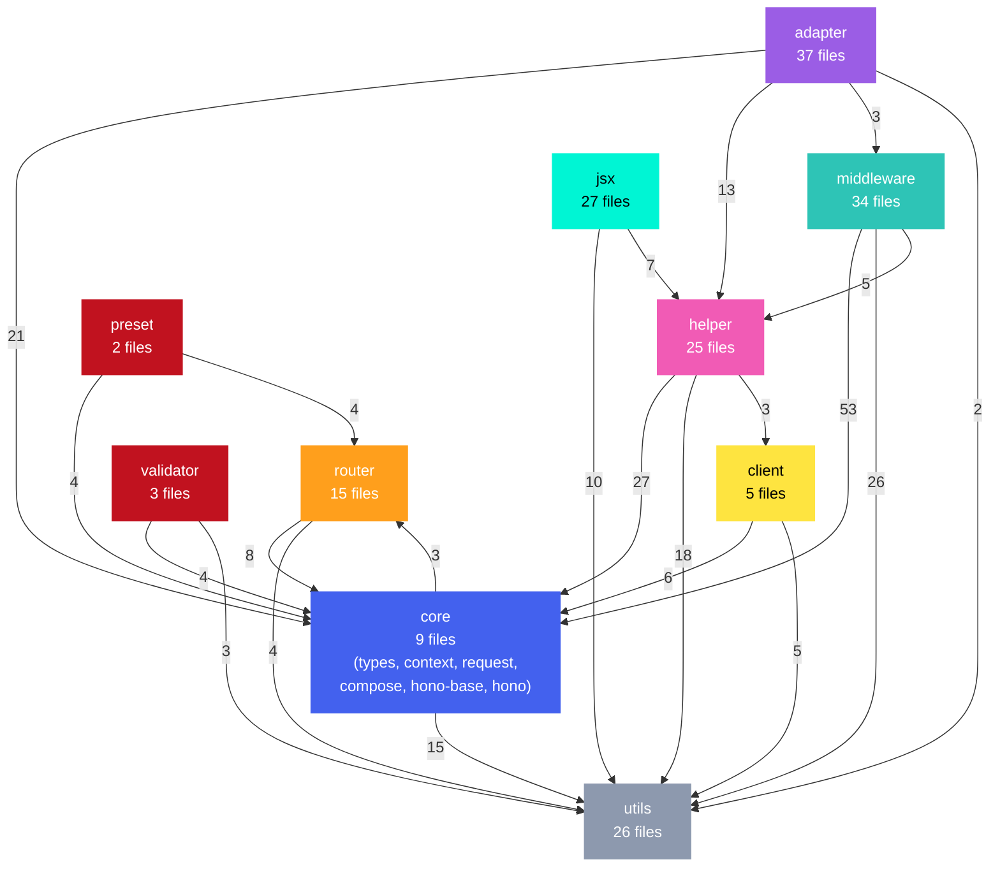
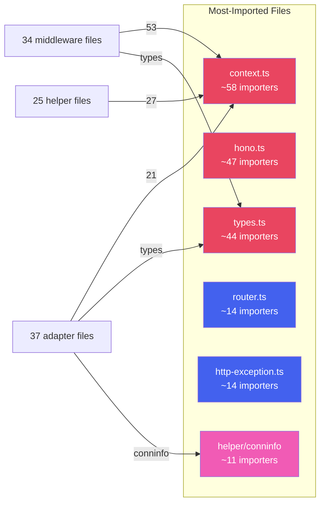

# Hono Module Dependency Map

> **Interactive version:** Open [`dependency-graph.html`](./dependency-graph.html) locally in a browser for the full 184-node, 470-edge force-directed graph with search, tooltips, and drag.

## Directory-Level Dependencies

Import counts between top-level directories (edges with fewer than 2 imports omitted for clarity):

## Most-Imported Modules (Hub Files)

These files are the most depended-upon across the codebase:

## Key Observations

- **`middleware/` → `core/`** is the heaviest dependency edge (53 imports) — every middleware imports Context and types
- **`utils/`** is the true foundation layer with zero upward dependencies (only 1 edge to core, likely a type import)
- **`jsx/`** is nearly isolated — only imports from `utils/` and `helper/`, never from `core/` directly
- **`adapter/`** depends on `core/` + `helper/` but never on other adapters (clean platform separation)
- **`context.ts`** is the single most-imported file in the entire codebase (~58 importers)
