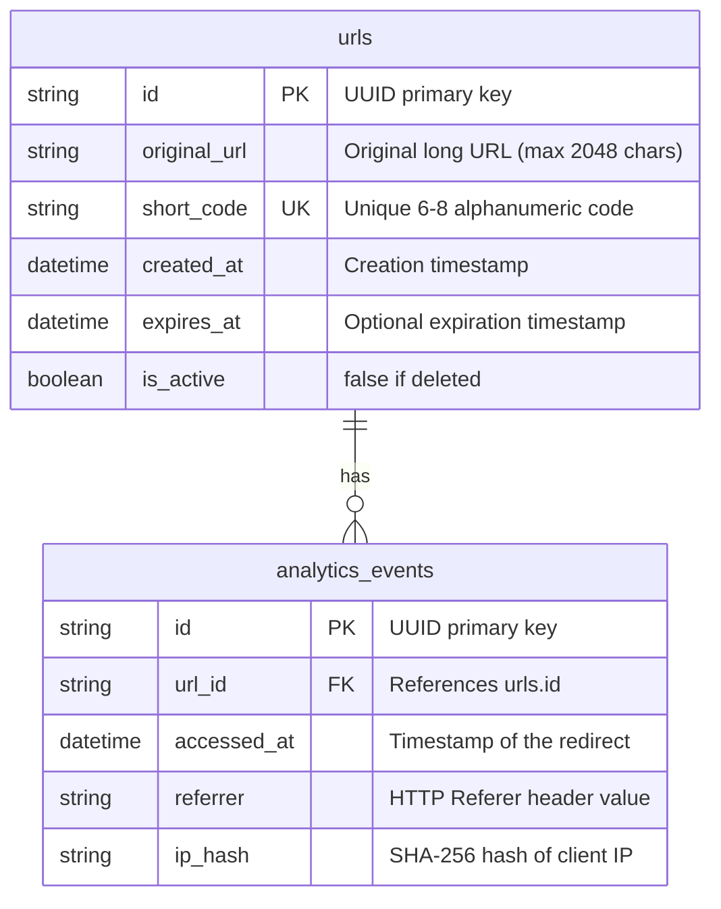

# URL Shortener — Entity Relationship Diagram

```mermaid
erDiagram
    urls {
        string id PK "UUID primary key"
        string original_url "Original long URL (max 2048 chars)"
        string short_code UK "Unique 6-8 alphanumeric code"
        datetime created_at "Creation timestamp"
        datetime expires_at "Optional expiration timestamp"
        boolean is_active "false if deleted"
    }

    analytics_events {
        string id PK "UUID primary key"
        string url_id FK "References urls.id"
        datetime accessed_at "Timestamp of the redirect"
        string referrer "HTTP Referer header value"
        string ip_hash "SHA-256 hash of client IP"
    }

    urls ||--o{ analytics_events : "has"
```
