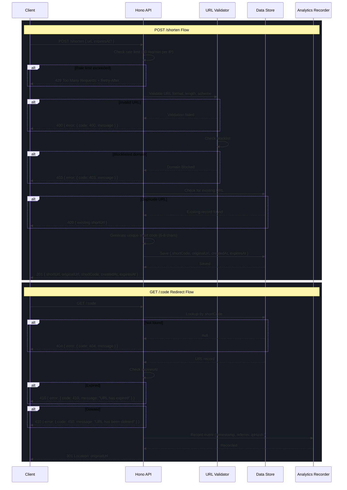

# URL Shortener — Request Sequence Diagram

```mermaid
sequenceDiagram
    participant Client
    participant API as Hono API
    participant Validator as URL Validator
    participant Store as Data Store
    participant Analytics as Analytics Recorder

    rect rgb(22, 27, 34)
    Note over Client,Analytics: POST /shorten Flow
    Client->>API: POST /shorten { url, expiresAt? }
    API->>API: Check rate limit (60 req/min per IP)
    alt Rate limit exceeded
        API-->>Client: 429 Too Many Requests + Retry-After
    end
    API->>Validator: Validate URL format, length, scheme
    alt Invalid URL
        Validator-->>API: Validation failed
        API-->>Client: 400 { error: { code: 400, message } }
    end
    Validator->>Validator: Check blocklist
    alt Blocklisted domain
        Validator-->>API: Domain blocked
        API-->>Client: 403 { error: { code: 403, message } }
    end
    API->>Store: Check for existing URL
    alt Duplicate URL
        Store-->>API: Existing record found
        API-->>Client: 409 { existing shortUrl }
    end
    API->>API: Generate unique short code (6-8 chars)
    API->>Store: Save { shortCode, originalUrl, createdAt, expiresAt }
    Store-->>API: Saved
    API-->>Client: 201 { shortUrl, originalUrl, shortCode, createdAt, expiresAt }
    end

    rect rgb(22, 27, 34)
    Note over Client,Analytics: GET /:code Redirect Flow
    Client->>API: GET /:code
    API->>Store: Lookup by shortCode
    alt Not found
        Store-->>API: null
        API-->>Client: 404 { error: { code: 404, message } }
    end
    Store-->>API: URL record
    API->>API: Check expiresAt
    alt Expired
        API-->>Client: 410 { error: { code: 410, message: "URL has expired" } }
    end
    alt Deleted
        API-->>Client: 410 { error: { code: 410, message: "URL has been deleted" } }
    end
    API->>Analytics: Record event { timestamp, referrer, ipHash }
    Analytics-->>API: Recorded
    API-->>Client: 301 Location: originalUrl
    end
```
