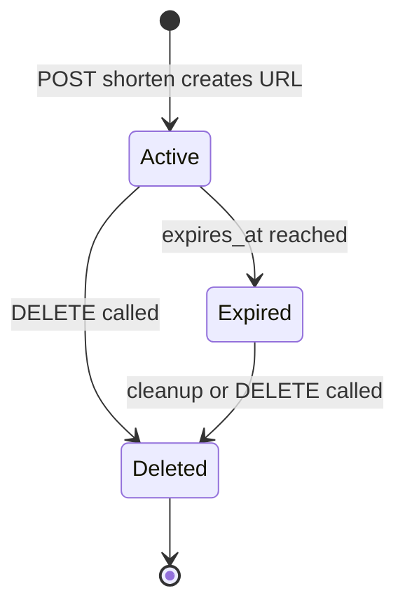

# URL Shortener — URL Lifecycle State Diagram

```mermaid
stateDiagram-v2
    [*] --> Active : POST shorten creates URL
    Active --> Expired : expires_at reached
    Active --> Deleted : DELETE called
    Expired --> Deleted : cleanup or DELETE called
    Deleted --> [*]
```
