# Hook Lifecycle — PreToolUse & PostToolUse

```mermaid
sequenceDiagram
    participant Dev as Developer
    participant CC as Claude Code
    participant Pre as PreToolUse Hooks
    participant Tool as Tool Execution
    participant Post as PostToolUse Hooks
    participant Audit as Audit Logs

    Dev->>CC: Prompt (e.g. "delete /tmp/test")
    activate CC

    Note over CC: Claude decides to use Bash tool

    rect rgb(22, 27, 34)
    Note over CC,Pre: PreToolUse Phase (3 hooks in sequence)
    CC->>Pre: validate-bash.py (matcher: Bash)
    alt Command is dangerous (rm -rf, etc.)
        Pre-->>CC: exit 1 + stderr "BLOCKED: rm -rf"
        Pre->>Audit: Append to blocked.log
        CC-->>Dev: ❌ "BLOCKED: rm -rf (recursive force delete)"
    else Command is safe
        Pre-->>CC: exit 0 (allow)
    end

    CC->>Pre: check-secrets.py (matcher: Edit|Write)
    Note right of Pre: Skipped — matcher "Edit|Write"<br/>does not match "Bash"

    CC->>Pre: scope-guard.sh (matcher: Edit|Write)
    Note right of Pre: Skipped — matcher "Edit|Write"<br/>does not match "Bash"
    end

    rect rgb(22, 27, 34)
    Note over CC,Tool: Tool Execution Phase
    CC->>Tool: Execute: git status
    Tool-->>CC: "On branch main, nothing to commit"
    end

    rect rgb(22, 27, 34)
    Note over CC,Post: PostToolUse Phase
    CC->>Post: audit-log.sh (matcher: *)
    Post->>Audit: Append JSONL to audit.jsonl
    Note right of Audit: {timestamp, user, branch,<br/>tool, input, result}
    Post-->>CC: exit 0
    end

    CC-->>Dev: ✅ Result: "On branch main"
    deactivate CC
```

## Matcher Behavior

| Hook | Matcher | Triggers On |
|------|---------|-------------|
| validate-bash.py | `Bash` | Only Bash tool invocations |
| check-secrets.py | `Edit\|Write` | Only Edit or Write tool invocations |
| scope-guard.sh | `Edit\|Write` | Only Edit or Write tool invocations |
| audit-log.sh | `*` | Every tool invocation (wildcard) |
| prompt-log.sh | `*` | Every user prompt (UserPromptSubmit) |
| session-summary.sh | `*` | Session end (Stop) |

## Exit Code Contract

- `exit 0` — Allow the tool to proceed
- `exit 1+` — Block the tool; stderr message shown to user
- Crash/error — Treated as exit 1 (fail-closed for safety)
