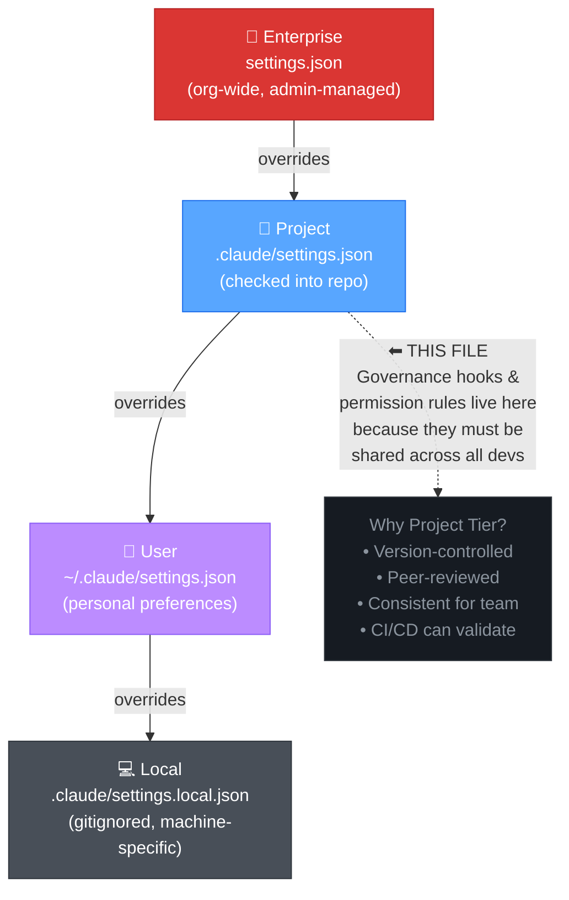

# Settings Hierarchy

## What Goes Where

| Tier | Example Content | Who Manages |
|------|----------------|-------------|
| **Enterprise** | "Never allow `Bash(rm -rf /)`" across all repos | Platform/Security team |
| **Project** | Hook definitions, permission allow/deny lists, cost limits | Tech lead, code-reviewed |
| **User** | Preferred model, output verbosity, theme | Individual developer |
| **Local** | Machine-specific paths, local API keys (gitignored) | Individual developer |

## Override Rules

- Higher tiers **cannot be overridden** by lower tiers
- Enterprise policies are absolute — no project or user setting can weaken them
- Project-level hooks run for every developer who clones the repo
- User and Local settings only add restrictions or personal preferences
