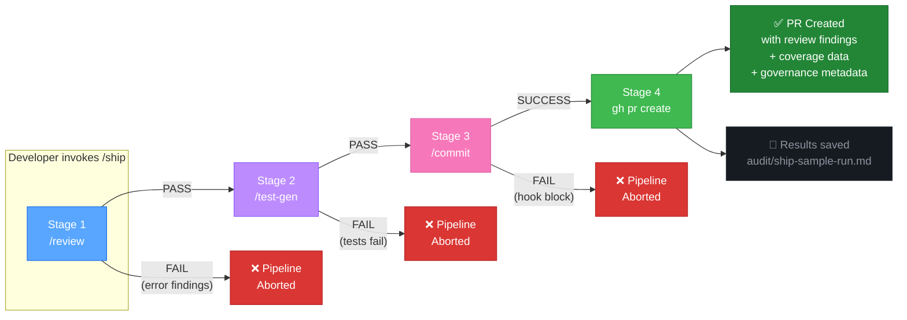

# /ship Pipeline Flow

## Key Design Decisions

- **Fail-fast ordering:** /review (fast, cheap) runs before /test-gen (slow, expensive)
- **Hard gates:** Any stage failure aborts the entire pipeline — no partial PRs
- **Audit trail:** Every run is recorded in `ship-sample-run.md` regardless of outcome
- **PR enrichment:** The PR body includes review findings and coverage data from earlier stages
