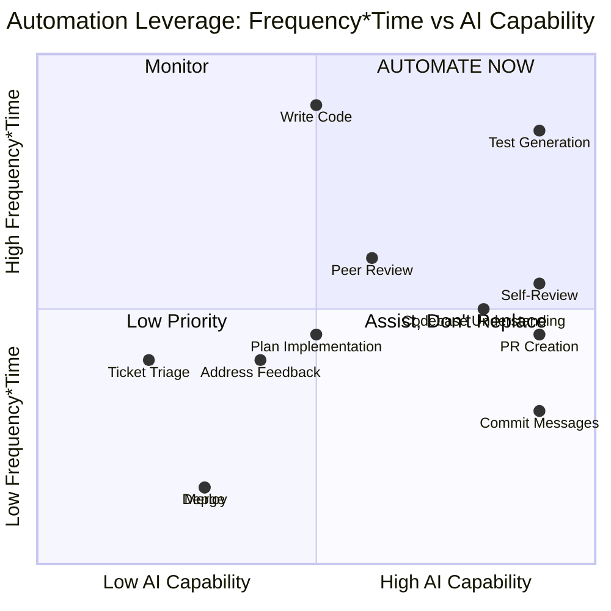

# Automation Leverage Framework

## Scoring Methodology

Each workflow step is scored on three dimensions:

| Dimension | Scale | Description |
|-----------|-------|-------------|
| **Frequency** | 1-10 | How often this step occurs (10 = every task, multiple times/day) |
| **Time per occurrence** | 1-10 | Minutes consumed (1 = <2 min, 5 = ~15 min, 10 = 30+ min) |
| **AI capability** | 1-10 | How well current AI tools can handle this (10 = fully automatable) |

**ROI Score** = (Frequency x Time x AI Capability) / 100, normalized to 1-10 scale.

Scores are grounded in real Week 2 experience building the URL shortener (23 tests, 7 requirements, 2 self-critique cycles).

## Scoring Table

| # | Workflow Step | Freq | Time | AI Cap | Raw Score | ROI (1-10) |
|---|--------------|------|------|--------|-----------|------------|
| 1 | Ticket Triage | 10 | 3 | 2 | 60 | 1 |
| 2 | Understand Codebase | 6 | 6 | 8 | 288 | 6 |
| 3 | Plan Implementation | 8 | 4 | 5 | 160 | 3 |
| 4 | Write Code | 10 | 8 | 5 | 400 | 5 |
| 5 | Write Tests | 10 | 7 | 9 | 630 | **9** |
| 6 | Self-Review & Lint | 10 | 4 | 9 | 360 | **8** |
| 7 | Commit & Push | 10 | 2 | 9 | 180 | 7 |
| 8 | Open PR | 8 | 3 | 9 | 216 | **8** |
| 9 | Peer Review | 6 | 8 | 6 | 288 | 6 |
| 10 | Address Feedback | 6 | 5 | 4 | 120 | 2 |
| 11 | Merge | 10 | 1 | 3 | 30 | 1 |
| 12 | Deploy | 5 | 2 | 3 | 30 | 1 |

## Top 3 Automation Targets

### Target 1: Test Generation (ROI: 9/10) --> `/test-gen`

Test writing is the highest-leverage automation target in the pipeline. It scores the highest across all three dimensions: every code change needs tests (frequency 10), each round consumes 25-30 minutes (time 7), and modern LLMs excel at generating test cases from function signatures and type definitions (AI capability 9).

In Week 2, writing 23 vitest tests for the URL shortener took longer than the implementation itself. Edge cases like expired URLs, duplicate short codes, and blocklisted domains required careful setup that followed predictable patterns -- exactly the kind of structured work AI handles well. The `/test-gen` command generates comprehensive test suites including happy paths, error cases, and boundary conditions, then runs them and reports coverage. The quality floor is high because generated tests are immediately validated by execution.

**Projected savings:** 25 min/feature (30 min down to 5 min review + adjustments)

### Target 2: Code Review (ROI: 8/10) --> `/review`

Self-review is universal (frequency 10) but fundamentally limited: developers have blind spots in their own code. In Week 2, the self-critique loop improved the security score from 6/10 to 9/10 -- proving that systematic review catches issues manual review misses. AI review capability is very high (9/10) because LLMs can check diffs against documented conventions in CLAUDE.md, detect common bug patterns (off-by-one, missing null checks, unclosed resources), and flag security issues (hardcoded secrets, injection vectors).

The `/review` command creates a multiplier effect: by catching issues before the PR is opened, it reduces peer review wait time (step 9) and feedback cycles (step 10). Combined with CLAUDE.md as the convention source, this becomes a living style enforcer that scales across the team.

**Projected savings:** 12 min/feature (15 min down to 3 min AI review) + reduced peer review cycles

### Target 3: PR Creation & Shipping (ROI: 8/10) --> `/ship`

Opening a PR with proper documentation is moderately frequent (8/10) and individually quick (~10 min), but its real cost is downstream: sparse PRs cause longer review times, missing test plans create back-and-forth, and manual orchestration of the review-test-commit-PR sequence wastes developer attention on process instead of product.

The `/ship` command chains the entire pipeline -- `/review` then `/test-gen` then `/commit` then `gh pr create` -- into a single invocation. Every PR follows the same quality bar: structured summary, test plan with coverage data, and governance metadata (which hooks were active, any blocks encountered). In Week 2, manually assembling PR descriptions and verifying all checks was repetitive work that followed the same template every time.

**Projected savings:** 8 min/feature (10 min down to 2 min invocation) + consistent PR quality

## Slash Command Mapping

All five slash commands map to high-ROI workflow steps:

| Command | Target Step(s) | ROI | Primary Value |
|---------|---------------|-----|---------------|
| `/test-gen` | 5. Write Tests | 9 | Eliminates most tedious step |
| `/review` | 6. Self-Review | 8 | Catches blind spots systematically |
| `/ship` | 6+5+7+8. Full pipeline | 8 | Single invocation, consistent quality |
| `/commit` | 7. Commit & Push | 7 | Conventional, descriptive messages |
| `/onboard` | 2. Understand Codebase | 6 | Living architecture summary |

## ROI Visualization

## Next Steps

These targets map directly to the slash commands built in Part 2 (Session B):
- `/test-gen` addresses Target 1 (ROI 9)
- `/review` addresses Target 2 (ROI 8)
- `/ship` chains all targets into a single pipeline (ROI 8)

The ROI report in Part 4 (Session C) will measure actual time savings using the REQ-SHORT-006 baseline task against the projections in this analysis.
