# Development Workflow Map

## Current SDLC Flowchart

```mermaid
flowchart TD
    A["1. Ticket Triage\n--- 10 min ---\nTools: GitHub Issues\nPain: Ambiguous acceptance criteria"]
    B["2. Understand Codebase\n--- 25 min ---\nTools: IDE, grep, git blame\nPain: No onboarding doc; tribal knowledge"]
    C["3. Plan Implementation\n--- 15 min ---\nTools: Notes, mental model\nPain: Large PRs hard to scope"]
    D["4. Write Code\n--- 45 min ---\nTools: VS Code, Claude Code\nPain: Boilerplate, context switching"]
    E["5. Write Tests\n--- 30 min ---\nTools: Vitest, supertest\nPain: Tedious edge cases; skipped coverage"]
    F["6. Self-Review & Lint\n--- 15 min ---\nTools: ESLint, git diff\nPain: Blind spots in own code"]
    G["7. Commit & Push\n--- 5 min ---\nTools: git CLI\nPain: Inconsistent messages"]
    H["8. Open PR\n--- 10 min ---\nTools: GitHub\nPain: Sparse descriptions; no test plan"]
    I["9. Peer Review\n--- 45 min ---\nTools: GitHub PR UI\nPain: 30 min wait + 15 min review; nit-heavy"]
    J["10. Address Feedback\n--- 20 min ---\nTools: IDE, git\nPain: Multiple review rounds"]
    K["11. Merge\n--- 2 min ---\nTools: GitHub\nPain: Occasional merge conflicts"]
    L["12. Deploy\n--- 5 min ---\nTools: Render / GitHub Pages\nPain: No smoke tests post-deploy"]

    A --> B --> C --> D --> E --> F --> G --> H --> I --> J --> K --> L

    style A fill:#ffeaa7,color:#000
    style B fill:#fab1a0,color:#000
    style C fill:#ffeaa7,color:#000
    style D fill:#74b9ff,color:#000
    style E fill:#fab1a0,color:#000
    style F fill:#fab1a0,color:#000
    style G fill:#ffeaa7,color:#000
    style H fill:#ffeaa7,color:#000
    style I fill:#fab1a0,color:#000
    style J fill:#fab1a0,color:#000
    style K fill:#55efc4,color:#000
    style L fill:#55efc4,color:#000
```

### Color Legend

| Color | Meaning |
|-------|---------|
| Red (`#fab1a0`) | High pain -- slow, error-prone, or tedious |
| Yellow (`#ffeaa7`) | Medium pain -- some friction but manageable |
| Blue (`#74b9ff`) | Core creative work -- developer value-add |
| Green (`#55efc4`) | Low friction -- mostly automated already |

## Step-by-Step Annotations

Annotations are grounded in real Week 2 experience building the Spec-Driven Feature Factory URL shortener.

### 1. Ticket Triage (10 min)
- **Tools:** GitHub Issues
- **Pain points:** Acceptance criteria often vague; REQ-SHORT-006 (soft delete) had no explicit definition of "soft" vs "hard" delete semantics until implementation time
- **AI opportunity:** Low -- requires domain/stakeholder context

### 2. Understand Codebase (25 min)
- **Tools:** IDE search, `grep`, `git blame`, reading specs
- **Pain points:** In Week 2, understanding the Hono routing pattern and store interface took significant time despite having formal specs. No centralized "start here" doc for new contributors. Architecture knowledge was all in the developer's head
- **AI opportunity:** HIGH -- `/onboard` generates a living architecture summary from actual code

### 3. Plan Implementation (15 min)
- **Tools:** Mental model, spec review, Mermaid diagrams
- **Pain points:** In Week 2, the state diagram helped but was created manually. Large features like analytics tracking required understanding cross-cutting concerns (store, routes, types) before writing the first line
- **AI opportunity:** Medium -- AI can suggest implementation plans given file context

### 4. Write Code (45 min)
- **Tools:** VS Code, Claude Code
- **Pain points:** Boilerplate (new route + handler + types + store methods + tests scaffold) for each requirement. Context switching between `routes/`, `lib/`, and `tests/` directories. In Week 2, each REQ-SHORT-00N followed the same pattern but required manual scaffolding
- **AI opportunity:** Medium -- already partially augmented with Claude Code; diminishing returns

### 5. Write Tests (30 min)
- **Tools:** Vitest, supertest
- **Pain points:** Most tedious step in Week 2. Writing 23 tests took longer than the implementation itself. Edge cases (expired URLs, duplicate short codes, blocklisted domains) required careful setup. Coverage motivation drops after happy-path tests pass
- **AI opportunity:** HIGH -- `/test-gen` generates comprehensive suites from function signatures and types

### 6. Self-Review & Lint (15 min)
- **Tools:** ESLint, manual `git diff` reading
- **Pain points:** In Week 2, the self-critique loop (security score 6 to 9/10) proved that developers miss issues in their own code. Manual diff reading is slow and attention fades on large changesets
- **AI opportunity:** HIGH -- `/review` checks diffs against CLAUDE.md conventions, catches security issues and style violations systematically

### 7. Commit & Push (5 min)
- **Tools:** `git` CLI
- **Pain points:** Commit messages varied wildly in Week 2 early commits ("Update index.js" vs proper "week-2: add redirect endpoint"). Inconsistency makes git log useless for understanding history
- **AI opportunity:** HIGH -- `/commit` generates conventional, descriptive messages from diff analysis

### 8. Open PR (10 min)
- **Tools:** GitHub PR form
- **Pain points:** PR descriptions often sparse. In Week 2, manual PR creation meant writing the summary, test plan, and checklist by hand. Reviewers lacked context when descriptions were rushed
- **AI opportunity:** HIGH -- `/ship` auto-generates PR with structured summary, test plan, and governance metadata

### 9. Peer Review (30 min wait + 15 min review)
- **Tools:** GitHub PR UI
- **Pain points:** Longest wait in the pipeline. Solo projects wait for self to context-switch back. Team projects have 30+ min reviewer queue. Reviews tend to focus on style nits over architecture
- **AI opportunity:** Medium -- `/review` pre-catches easy issues so human reviewers focus on design decisions

### 10. Address Feedback (20 min)
- **Tools:** IDE, git
- **Pain points:** Multiple review rounds. In Week 2, the self-critique loop required 2 cycles to reach acceptable quality. Nit-fixing is low-value work
- **AI opportunity:** Medium -- reduced if `/review` catches issues before PR is opened

### 11. Merge (2 min)
- **Tools:** GitHub merge button
- **Pain points:** Occasional merge conflicts on long-lived branches
- **AI opportunity:** Low -- already fast

### 12. Deploy (5 min)
- **Tools:** Render auto-deploy, GitHub Pages
- **Pain points:** No automated smoke tests post-deploy in Week 2
- **AI opportunity:** Low for this project

## Summary Statistics

| Metric | Value |
|--------|-------|
| **Total cycle time** | ~227 min (~3.8 hours) per feature |
| **High-pain steps** | 5 of 12 (steps 2, 5, 6, 9, 10) |
| **AI-automatable time** | ~95 min (steps 2, 5, 6, 7, 8) |
| **Potential time savings** | ~42% of total cycle time |
| **Slash commands mapped** | 5 commands covering all high-ROI steps |
