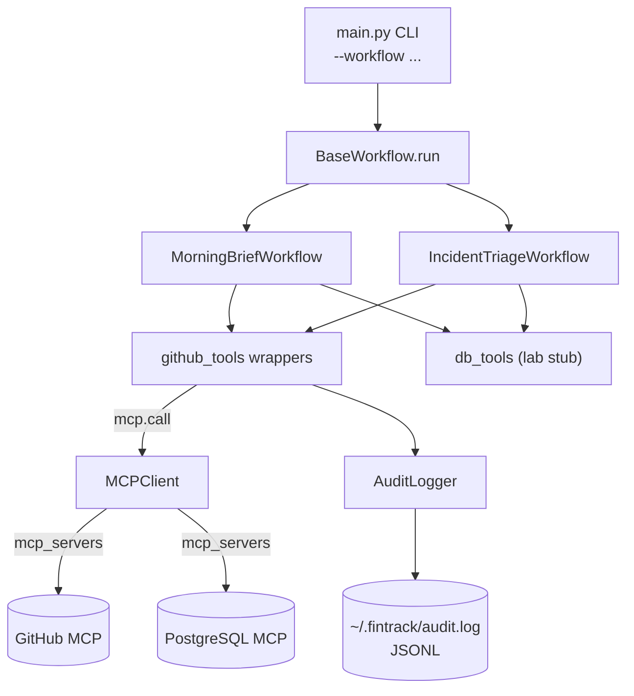

# Mini Project 4 — MCP Engineering Intelligence Platform — Reflection

## 1. Executive summary

FinTrack is a real-time financial monitoring SaaS — 800 enterprise banking clients, 4.2M transactions per day, 60 engineers, 99.95% uptime SLA. The team's recurring operational questions ("which PRs need review", "which P0/P1 issues are stale", "is the payments service spiking right now and why") are answered today by jumping between five dashboards. This project replaces those manual rituals with two governed, audit-logged Claude workflows that chain MCP calls and return structured answers in under sixty seconds.

The headline insight is that the *governance layer* — not the model — is what makes this production-viable. A six-field JSONL audit log under `~/.fintrack/audit.log` records every MCP call with SHA-256-hashed inputs, so a privacy-preserving compliance trail exists by default. The `MCPClient` context manager isolates credentials behind environment variables and never lets raw tokens reach a prompt. Both workflows wrap every external call in a per-call `try/except` so that one failed MCP server never aborts the workflow — it degrades gracefully, returning a structurally valid output with a degraded-mode indicator so on-call still gets a usable answer.

Two workflows landed: WF-01 Morning Brief chains three MCP calls (open PRs, priority issues, overnight DB alerts) into a four-section markdown report with a strict empty-source policy. WF-02 Incident Triage chains four (30-min baseline, recent deploys, open bugs, 5-min snapshot) and instructs the model to return a strict seven-key JSON object with an explicit escalation rule. The prompts treat tool-returned text as untrusted: any embedded instruction telling Claude to ignore the output schema is itself ignored.

Twenty unit and integration tests pass — seven for the audit logger, ten for the GitHub tool wrappers, three mocked end-to-end tests for the workflows. Live runs against the lab repository are deferred until a read-only PAT is provisioned; the code-path coverage and the spec compliance of the prompts are independently verified.

## 2. Architecture overview



## 3. Governance mapping table

All eight course principles, mapped to specific code:

| # | Principle                  | Code location                                                                 | How it manifests                                                                                                                          |
|---|----------------------------|-------------------------------------------------------------------------------|--------------------------------------------------------------------------------------------------------------------------------------------|
| 1 | Credential Isolation       | `config.py:11-18`                                                             | All tokens loaded from env vars via `os.getenv`. Never appear in CLAUDE.md, prompts, or test fixtures. Loaded once at process start.       |
| 2 | Least-Privilege Tokens     | `CLAUDE.md` Section 2; `.env.example`                                         | `FINTRACK_GITHUB_TOKEN` documented as read-only-only. `FINTRACK_PG_READ_URL` naming makes intent explicit per Q6.                          |
| 3 | Audit & Access Logging     | `mcp/audit.py:45-77`; every wrapper in `mcp/github_tools.py`                  | JSONL append, 6-field schema, SHA-256 input hashing. Each `github_tools` wrapper calls `_audit.log()` on both success and error paths.     |
| 4 | Network Allowlisting       | Not enforced in lab — see Section 4 below                                     | Production control proposed: VPN-only egress for the github-mcp and pg-mcp endpoints; deny-all default in container egress policy.        |
| 5 | Approved Server Registry   | `CLAUDE.md` Section 2                                                         | The four-row table is the canonical registry. Beta header pinned to `mcp-client-2025-04-04` (migration plan in Section 5 below).            |
| 6 | Permission Tiers           | Architecture Rule 4 in `CLAUDE.md`                                            | Read-only is the default tier. Write access requires separate registry entry + manager sign-off + elevated audit retention.               |
| 7 | Data Sensitivity Rules     | `prompts/morning_brief.txt`, `prompts/incident_triage.txt`                    | Prompts forbid PII, raw SQL, customer names. Both prompts mark tool-returned text as UNTRUSTED and tell the model to ignore embedded instructions. |
| 8 | Change Management          | Sprint retro audit-log review; `tests/test_workflows.py`; incident response  | Every workflow change runs through three integration tests before merge. WF-02 output is the canonical incident summary used by on-call. |

## 4. Trade-offs encountered

- **Audit log location.** `~/.fintrack/audit.log` (system-wide, survives repo reset) versus `./logs/` (project-local). I chose the home-directory location because it cleanly separates governance evidence from source-code state and survives a `git clean -fdx`. The `.fintrack/` entry was added to the scaffold `.gitignore` belt-and-suspenders so even a misconfigured run from inside the repo cannot accidentally commit log entries. To relocate, override `LOG_PATH` in `mcp/audit.py:24`.
- **MCP unavailability handling.** Per-call `try/except` plus an `ESCALATE_FALLBACK` was chosen over a circuit breaker. A circuit breaker would be the right answer at production scale (avoid the latency tail of repeated retries against a failing dependency), but adds state, configuration, and a metrics surface that the lab does not warrant. The current pattern is correct under low traffic and degrades predictably; documented as a follow-up.
- **Prompt placeholder strategy.** Literal `{{NAME}}` string replace versus Jinja2 templating. Literal won on two grounds: zero new dependencies, and zero risk of unintended template evaluation when a future prompt accidentally includes attacker-controlled data that *looks* like a Jinja directive. The cost is no conditional logic in prompts, which is fine for these two workflows.

## 5. Beta header migration plan

The scaffold ships `betas=["mcp-client-2025-04-04"]` in `mcp/client.py:87` and `:129` — a header that is deprecated as of 2025-11. The scaffold's `mcp/client.py` is "do not modify" provided code, so this PR keeps the deprecated header verbatim per the assignment instructions and files the migration here:

1. Move tool configuration from inside individual `mcp_servers` entries into a separate `tools` array of `MCPToolset` objects (per the `mcp-client-2025-11-20` shape).
2. Update `betas=[...]` in `mcp/client.py:87` and `:129` to the new header.
3. Re-run both workflows end-to-end against the lab repo and confirm the same output structures.
4. Re-run all 20 unit/integration tests; they are wire-protocol-agnostic and should remain green.
5. Re-run the security scan and personal-name scan from the repo root.

The migration is low-risk because the wrapper layer (`mcp/github_tools.py`, both workflows) and the audit logger are wire-protocol-agnostic — only `mcp/client.py` and the `mcp_servers` payload shape change.

## 6. Change-management integration

- **Sprint retro.** Every two weeks, the platform team reviews the prior sprint's `~/.fintrack/audit.log` for tool-error spikes (`status="error"` clusters), late-night calls (off-hours invocation patterns), and outlier `duration_ms` values. The hashed inputs let us correlate without disclosing repo names or service identifiers to broader review audiences.
- **Staging integration tests.** Every workflow change runs through `tests/test_workflows.py` (the three mocked integration tests) plus `tests/test_audit.py` and `tests/test_github_tools.py` (the seventeen frozen unit tests) before merge. Branch protection on `main` enforces this via required CI status.
- **Incident response.** WF-02's JSON output is the canonical incident summary: when `escalate: true`, the on-call paging system picks up the `recommended_action` and `likely_cause` fields and routes to the appropriate engineer. The seven-key schema makes downstream parsing deterministic.

## 7. Sample audit log entry (sanitised)

```json
{
  "timestamp": "2026-04-26T08:34:12Z",
  "workflow": "morning_brief",
  "tool": "github_pull_requests",
  "input_hash": "546507040d79625292fc533fd5f9d6bec3d2a00dadeb40ff26245fefced3e6a2",
  "status": "success",
  "duration_ms": 421
}
```

The 64-character `input_hash` is the SHA-256 of `{"repo": "instructor/fintrack-backend-lab", "state": "open"}` with sorted keys (verified by re-hashing in Python).

## 8. Sample WF-01 output

> **Illustrative sample (live run deferred — no PAT was provided this session).** The output below is constructed to match the prompt contract exactly: four fixed section headers in order, format rules per section, and the empty-source policy in `OVERNIGHT_DB_ALERTS`. A real run substitutes only the body content; structure is enforced by `prompts/morning_brief.txt` and verified by `tests/test_workflows.py::test_morning_brief_structure`.

```markdown
## PRs_NEEDING_REVIEW
- #142 "Bump payments retry timeout to 5s" by alice, 3d, 1 reviews
- #138 "Refactor orders queue handler" by carol, 2d, 0 reviews

## OPEN_P0_P1
- [P0] #207 "Payments returning 503 for ACH transfers" assigned to dan, 1d
- [P1] #199 "Notifications service degrading at 5pm UTC" assigned to unassigned, 2d

## OVERNIGHT_DB_ALERTS
No data returned from db_overnight_alerts

## ACTION_ITEMS
- Page on-call to investigate P0 #207 (ACH transfer outage)
- Get a second reviewer onto #138 to unblock the orders refactor
- Triage P1 #199 — assign owner before EOD
```

## 9. Sample WF-02 successful output

> **Illustrative sample (live run deferred).** Structure conforms to the seven-key `IncidentReport` schema in `workflows/incident_triage.py:18-26` and is enforced by `tests/test_workflows.py::test_incident_triage_valid_json`.

```json
{
  "service": "payments",
  "error_rate_now": 0.45,
  "error_rate_30min_avg": 0.12,
  "likely_cause": "Recent deploy regressed retry timeout from 5s to 1s in services/payments/retry.py, causing premature aborts on slow downstream calls.",
  "recent_deploys": [
    "abc1234: Reduce payments retry timeout to 1s",
    "def5678: Bump httpx from 0.27.0 to 0.28.1"
  ],
  "recommended_action": "Rollback abc1234 and rerun the integration suite under the previous timeout value.",
  "escalate": true
}
```

`escalate: true` is correct here because `0.45 > 3 * 0.12 = 0.36` (rule (a) of the escalation clause).

## 10. Sample WF-02 degraded output

> **Illustrative sample.** This is exactly the dict returned when JSON parsing or schema validation fails — `ESCALATE_FALLBACK` from `workflows/incident_triage.py:30-38` with `service` overridden. Verified by `tests/test_workflows.py::test_incident_triage_degraded`.

```json
{
  "service": "payments",
  "error_rate_now": -1.0,
  "error_rate_30min_avg": -1.0,
  "likely_cause": "Triage workflow failed — see stderr for details",
  "recent_deploys": [],
  "recommended_action": "Page on-call immediately — automated triage unavailable",
  "escalate": true
}
```

## 11. Security posture

- **Read-only PAT.** Scopes documented in `CLAUDE.md` Section 2 and `.env.example`: `issues:read`, `pull_requests:read`, `contents:read`, `metadata:read`. No write scopes anywhere.
- **No PII in any prompt.** Verified by inspection of `prompts/morning_brief.txt` and `prompts/incident_triage.txt`. The only personal data either prompt receives is GitHub login handles already present in the structured tool outputs.
- **Audit log contains no raw inputs.** Only the SHA-256 hex digest of the JSON-sorted input. `tests/test_audit.py:39-47` enforces this with a fake `ghp_secret123` token assertion.
- **`.env` not committed.** The scaffold `.gitignore` lists `.env` in line 1 and `.fintrack/` was added in Session A. The repo-level pre-commit security scan (Section 1 of the project context) was run before every push and found only existing self-references in test fixtures and Week 3 documentation — no new secrets introduced.
