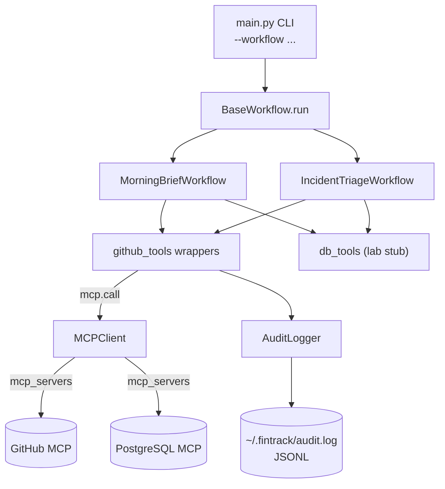

# Architecture — MCP Engineering Intelligence Platform

## How `MCPClient` mediates between workflows and MCP servers

`MCPClient` (`mcp/client.py`) is the single seam between FinTrack's workflow code and external MCP servers. It is used as a context manager: `__enter__` initialises an `anthropic.Anthropic()` client, `__exit__` releases it, and the body of the `with` block can call either `mcp.call(tool_name, tool_input)` for a single typed tool invocation or `mcp.ask(prompt)` for a free-form prompt where Claude itself decides which tools to fire. Both paths funnel through `_mcp_servers()`, which builds the `mcp_servers` list dynamically from `Config` — `github-mcp` is registered only if `FINTRACK_GITHUB_TOKEN` is set, `pg-mcp` only if `FINTRACK_PG_READ_URL` is set. The deprecated `betas=["mcp-client-2025-04-04"]` header is pinned per the assignment's "do not modify" rule; the migration plan to `mcp-client-2025-11-20` lives in `REPORT.md` Section 5.

## The audit pattern

Every wrapper in `mcp/github_tools.py` follows the same three-line bookkeeping protocol around its single `mcp.call()`: (1) capture `start = time.perf_counter()` before the call, (2) compute `duration_ms = int((time.perf_counter() - start) * 1000)` after the call returns or raises, and (3) emit one `_audit.log(...)` entry with `workflow="github_tools"`, the tool name, the input dict, the status (`success` or `error`), and the duration. The `AuditLogger` itself (`mcp/audit.py`) is intentionally bulletproof — it wraps all I/O in `try/except (OSError, ValueError, TypeError)` and on any error prints to stderr and returns silently. A failed audit write must never crash a caller. Inputs are SHA-256 hashed before persistence so the log file never contains repo names, label names, or service identifiers in cleartext.

## `BaseWorkflow`'s timing and error wrapping

`workflows/base.py:36` defines a single `run()` method that every workflow inherits. `run()` records `time.perf_counter()`, calls `self.execute(**kwargs)` inside a try block, prints elapsed milliseconds via `rich.console`, and on exception prints a traceback and re-raises. This is the per-workflow boundary: the audit logger sits below at the per-call boundary, `run()` sits above at the per-workflow boundary, and together they produce a hierarchical observability record. Concrete workflows implement only `execute()` and inherit the timing and error semantics for free.

## How to extend

To add a third workflow (for example, a Sprint Health workflow that consumes `jira-mcp`):

1. Add the new server to `CLAUDE.md` Section 2 (Approved Server Registry) with its access tier, owner, and scope.
2. Add the env var to `.env.example` and to `Config` in `config.py`.
3. Add the tool wrappers under `mcp/jira_tools.py`, copying the timing + audit pattern from `mcp/github_tools.py` line for line.
4. Add the prompt template under `prompts/sprint_health.txt`, including the prompt-injection-resistance clause.
5. Subclass `BaseWorkflow` in `workflows/sprint_health.py`, inject placeholders, call `mcp.ask`, return.
6. Add an integration test to `tests/test_workflows.py` mirroring the existing two patterns.

The audit logger and `MCPClient` need no changes — they are infrastructure, not domain logic.
