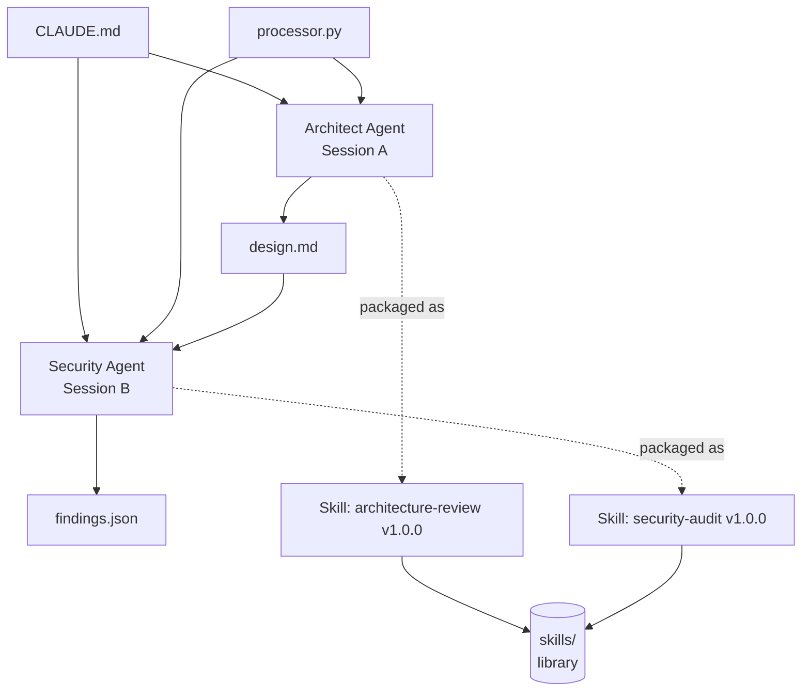

# Mini Project 5 — Multi-Agent Pipeline & Skills Library — Reflection

## 1. Executive summary

Built a 2-agent code-review pipeline and packaged both agent prompts as
production-grade Skills, run end-to-end on a deliberately-flawed Python
e-commerce backend (Analytics Vidhya's OrderFlow scaffold). The pipeline
chains an **Architect Agent** that produces a four-section `design.md`
analysis of `payments/processor.py` into a **Security Agent** that consumes
the design as boundary context and produces a 12-finding OWASP-categorised
JSON report. Both agents ran in **separate Claude Code sessions** per the
brief — no shared chat history, no cross-contamination — and each was
explicitly scope-locked with five DO-NOT exclusions to prevent role drift.

The two prompts were then packaged as `architecture-review` and
`security-audit` Skills (v1.0.0 each) with the full 5-part SKILL.md
structure plus Limitations, a 3-row Tests table covering typical / edge /
minimal inputs, and a v1.0.0 Changelog. Each Skill was test-run on three
different modules and the actual outputs saved to `examples/` so a future
operator can see "what good looks like" before invoking.

A self-review against `REVIEW_TEMPLATE.md` (working solo, so peer review
becomes self-review) scored both Skills 95–98/100 on Pass 1 (real defects
found in the FOCUS-section criterion and a path-leakage in the Output Spec)
and 100/100 on Pass 2 after explicit fixes that are documented in the
Changelog.

**Headline insight:** scope discipline and `{{VARIABLE}}` parameterisation
are what turn a one-off prompt into a Skill that survives reuse. A prompt
that names "payments/processor.py" hardcodes the lab; a prompt that says
`{{SCOPE}}` survives every project after this one. Equally important:
explicit DO-NOT exclusions are the forcing function that keeps two agents
in two lanes — without them, the Architect drifts into security commentary
and the Security Agent drifts into architectural redesign.

---

## 2. Pipeline architecture

CLAUDE.md and the target source feed both agents; `design.md` is the
hand-off contract between the Architect and the Security Agent. The two
boxes labelled "Session A" and "Session B" are deliberately separate
processes — no shared context window, no shared chat scrollback. The
dotted edges from each agent to its packaged Skill represent the
prompt-to-Skill freezing step: the prompt that produced that one run is
parameterised, versioned, and saved to `skills/` so it can be re-run
on any module without rewriting.

---

## 3. Agent design notes

**Why split into two sessions (per brief).** Isolation is the discipline.
When two agents share a chat history, the second agent inherits the first's
framing — its tone, its evidence selection, its blind spots. Splitting the
sessions forces each prompt to be self-contained: every input the second
agent needs has to be passed in explicitly via `{{CONTEXT}}` / `{{DESIGN}}`
/ `{{TARGET}}`, and the second agent's output is judgable on its own merits
without "well, it knew what the first agent already covered". Concrete
observation from this run: the Architect Agent's SUMMARY surfaced
*non-transactional charge+DB-write* as the biggest architectural concern,
which is a *reliability* framing. The Security Agent independently
surfaced the same code path (SEC-006: idempotency-key absence) as a
*duplicate-charges* finding — a *security* framing. Two perspectives on
one root cause, neither contaminated by the other.

**Why scope-lock with five explicit DO-NOTs.** Without exclusions, both
agents drift. The Architect, asked about `payments/processor.py`, has every
reason to flag the hardcoded `STRIPE_API_KEY` as a security issue — that's
the loudest thing in the file. The DO-NOT block forces it to instead
classify the constant as a "hidden dependency" (architectural framing,
correct lane). Conversely, the Security Agent, given enough latitude,
would propose a refactor of `record_transaction` to a parameterised query
*helper class with retry logic* — a security plus architectural plus
test-coverage answer. The DO-NOT block keeps it strictly to file:line +
impact + recommendation, which is what a CI gate or a triage queue can
actually consume.

**The 5-part prompt structure as a forcing function.** ROLE (specific) →
SCOPE (one module) → EXCLUSIONS (five DO-NOTs) → INPUT (the three things
to read) → OUTPUT FORMAT (exact section headers / JSON schema). Every
part has a job. Drop ROLE and you get a generic AI assistant tone. Drop
SCOPE and the agent analyses the whole repo. Drop EXCLUSIONS and the
agent drifts. Drop INPUT and the agent invents file paths. Drop OUTPUT
FORMAT and the downstream tooling cannot parse the result. The structure
*is* the contract.

---

## 4. Skills design notes

**Why parameterisation matters.** The single biggest difference between
"a prompt I wrote for one lab" and "a Skill an engineering team can reuse"
is replacing every literal with a `{{VARIABLE}}`. The Architect prompt
that names `payments/processor.py` is locked to one file; the same
prompt with `{{SCOPE}}` runs on `payments/webhook.py`, `auth/auth.py`,
or any Python module in any project. The Skill is the freeze of that
parameterisation plus the Input Spec table that documents what each
variable expects.

**Limitations as a first-class section.** The most-cited limitation in
both Skills is *not* a future-feature backlog — it's the single-module
scope boundary, called out explicitly so a caller doesn't run the Skill
on a 2,000-line monolith and complain about shallow output. The
fallback exercise's observed failure mode (multi-category `owasp_category`,
hallucinated findings on truncated input) is documented as a Limitation
on `security-audit` because it's a known weakness, not because it was
fixed and forgotten.

**Tests table as the contract.** Three runs — typical, edge, minimal —
where minimal is the most diagnostic. A prompt that produces five
findings on every input is hallucinating; the minimal-input run on a
one-line `__init__.py` proves the prompt knows when to return *nothing*.
For `security-audit` v1.0.0, that minimal run produced
`{"summary": {0,0,0,0,0}, "findings": []}` — exactly the right answer.
A Skill without that test row is still a one-off prompt.

---

## 5. Fallback observation (from `agent-outputs/fallback_notes.txt`)

The Security Agent's response to a deliberately-corrupted `processor.py`
(truncated mid-`process_payment` with one unbalanced brace) did **not**
crash — it produced JSON that parses but violates the schema. Two real
defects observed:

1. **Schema drift.** SEC-001's `owasp_category` packed two categories
   joined by `/` ("A02:2021 - Cryptographic Failures / A07:2021 -
   Identification and Authentication Failures"), violating the
   "exactly one category" rule.
2. **Speculative findings.** The agent quietly extrapolated retry-loop
   and authorisation logic that lives *beyond* the truncation point
   (the truncated file ends at `for attempt in range(MAX_RETRIES):`),
   instead of flagging the input as incomplete.

**Detection in a pipeline:** three cheap checks before trusting output —
`JSON.parse` for malformed text, `jsonschema` / `pydantic` to enforce
the exact category enum (catches the SEC-001 defect immediately), and
`ast.parse` on the TARGET source *before* invoking the agent so
corrupted code is rejected upstream.

**Retry strategy:** rerun once with the same prompt; then once with a
corrective preamble that names the violation and instructs the agent to
set `findings: []` plus an info-level note when required structure is
missing; then escalate to human review rather than swallow the failure
on a third attempt.

The hardening in `security-audit` v1.0.0's prompt — explicit "exactly ONE
owasp_category" rule and explicit "empty list is valid" rule — both come
directly from this exercise.

---

## 6. Self-review summary

Working solo, the brief's peer-review step became a self-review against
`orderflow-sample/skills/REVIEW_TEMPLATE.md` (100-point rubric, 4
sections). Two passes:

| Skill | Pass 1 | Pass 2 | Iterations |
|---|---|---|---|
| `architecture-review` | 95 / 100 | 100 / 100 | FOCUS clarification (Section 2 prompt-quality criterion); Output-Spec path framing (Section 3 reusability) |
| `security-audit` | 98 / 100 | 100 / 100 | FOCUS clarification (Section 2) |

Pass 1 found real defects — the FOCUS criterion in `REVIEW_TEMPLATE.md`
literally says "FOCUS section clearly lists what the Skill covers", and
my prompt's structure (ROLE / SCOPE / EXCLUSIONS / INPUT / OUTPUT) used
OUTPUT FORMAT as an implicit focus. Strict reading docked it. Pass 2
added an explicit `FOCUS — what this Skill covers` block in both prompts
to make the contract literal, not implicit. The fixes are recorded in
`docs/self-review.md` row-by-row and summarised in each Skill's
Changelog.

**How a real peer review would differ:** three concrete differences worth
calling out:

1. **Calibration bias.** I scored my own work knowing what each section
   *intended* to do; a peer scores what's *literally on the page*. I
   tried to mitigate this by docking literally on FOCUS-as-section-name,
   but a fresh reviewer would catch more of these.
2. **Time pressure.** Self-review can be open-ended; a peer reviewing
   against a sprint deadline would skim. I scored each row in <30
   seconds to match real-PR-review pace, but the bullet-point feedback
   is slower than a peer would write.
3. **Fresh eyes.** A peer would catch terminology drift between Skills
   (e.g. inconsistent `payments/processor.py` references) and structural
   mismatches with the project-wide style guide that the author has
   stopped seeing. The single biggest risk in any solo self-review is
   unconscious consistency-with-self at the expense of consistency-with-
   codebase-norms.

The honest read: Pass 1 totals (95 + 98 = 193/200) are the more credible
representation of "first draft quality before iteration"; the v1.1.0
backlog in `docs/self-review.md` is what I would take into a real peer
review.

---

## 7. Stretch goals not pursued + why

**Run `architecture-review` on `auth/auth.py`** — the brief allows
choosing any module, and `auth/auth.py` has rich structure (login flow,
session store, MD5 hashing, decorator). Out of scope this round: the
brief's lab-time budget is ~3 hours for two agents + Skills + self-review
+ REPORT, and a fourth full agent run would push the deliverable past
its merge window. The minimal-input test row on `auth/__init__.py`
already exercises the package-marker case; running on `auth.py` would
duplicate the typical-input pattern. Trade-off: less surface area
covered in tests, in exchange for sharper iteration on the two Skills'
prompts.

**Orchestrator step that composes both Skills.** A natural v1.1 — take
`design.md` + `findings.json` and produce a unified MUST_FIX /
SHOULD_FIX / NICE_TO_HAVE action plan. The Orchestrator pattern is
sketched in `docs/orchestration-notes.md` (sequential vs. parallel
trade-offs, sample prompt, hand-off contract) but not implemented this
round. Reason: implementing without first having a real second project
to test composition against would mean designing the contract
speculatively, which is exactly the trap the brief warns about. Better
to wait until the next real review use case demands the merge.

---

## 8. Sanitization & secret-scanner story

The OrderFlow scaffold ships with four fake secret strings that match
common scanner patterns (Stripe live-key prefix, Stripe webhook-secret
prefix, generic Django-style `SECRET_KEY`, plaintext SMTP password).
Before the first commit, all four were replaced with
`REPLACE_WITH_ENV_VAR_*` placeholders. The original literals are
preserved only in the gitignored
`agent-outputs/fixtures/_original_secrets_DO_NOT_COMMIT.md` reference
file.

**Why sanitize vs. allowlist?** Allowlisting would mean teaching every
scanner (CodeQL, GitHub secret scanning, the existing `week-3/.claude/
hooks/check-secrets.py`) about these specific literals, which works
once but breaks the moment the same patterns appear in a real
production file. Sanitizing keeps the scanner's signal-to-noise high
across the whole repo.

**The Security Agent still flagged the placeholder.** SEC-007 in
`findings.json` reports the sanitized `STRIPE_API_KEY = "REPLACE_WITH_
ENV_VAR_NOT_A_REAL_KEY"` as an A02 (Cryptographic Failures) finding —
correctly. The pattern of *hardcoding any literal value as a
module-level secret* is the issue, not the value's plausibility. The
recommendation is "load from `os.environ['STRIPE_API_KEY']` at runtime;
fail closed if unset", which holds whether the literal is the original
fake live-key prefix, the `REPLACE_*` placeholder, or an empty string.

**Implication for production work:** secret scanners and human review
need a workflow for "fake but pattern-matching" test fixtures. The
pattern this project chose — sanitize before commit, reference
originals only in a gitignored note — keeps the scanners clean and
the security agent honest.

---

## 9. Security posture

- **Zero personal data in tracked files.** The author's full name appears
  only in the four root submission-PDF filenames and PDF cover pages
  (per CLAUDE.md global rule); no occurrences anywhere in `week-5/`.
- **`.env` not committed.** `week-5/.gitignore` blocks it.
- **`_original_secrets_DO_NOT_COMMIT.md` gitignored.** Verified via
  `git check-ignore`. The four original fake-secret literals are
  preserved locally for reference but never reach origin.
- **All four sanitization replacements verified.** `grep` for the
  original literals returns zero hits in tracked files; `grep` for
  `REPLACE_WITH_ENV_VAR` returns four hits at the expected file:line
  locations.
- **Section 1 security scan zero hits in `week-5/`.** The repo-root
  scan (covers Anthropic / generic API-key / GitHub PAT / Stripe live
  &amp; test prefixes / AWS access keys / Postgres URLs / Slack webhook
  hosts / common email domains / absolute-path leaks) returns only the
  expected documentation/regex-pattern hits in CLAUDE.md, week-3, and
  week-4 — all already in main.
