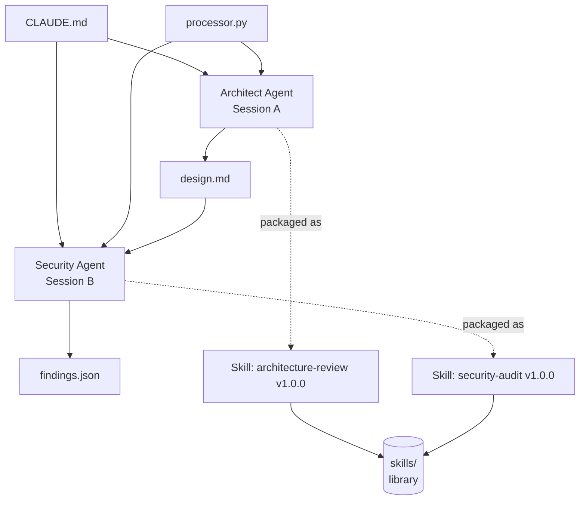

# Pipeline Architecture — Multi-Agent Code Review

This document captures the architecture of the two-agent pipeline built in
Week 5 and shipped as `architecture-review` and `security-audit` Skills.

## Diagram

## Two-session isolation pattern

The two agents run in separate Claude Code sessions — separate processes,
no shared chat history, no shared context window. This is the core
discipline of the brief: the Security Agent must not inherit the
Architect's framing, evidence selection, or blind spots, and the Architect
must not be biased by the Security Agent's worldview either.

The forcing function for isolation is the prompt itself. Every input each
agent needs to do its job is named explicitly in its prompt's INPUT block:

- Architect inputs: `{{CONTEXT}}` (CLAUDE.md), `{{TARGET}}` (full source
  of the scoped module).
- Security inputs: `{{CONTEXT}}` (CLAUDE.md), `{{DESIGN}}` (the Architect's
  design.md, optional but recommended), `{{TARGET}}` (full source).

Notice what is *not* in either INPUT list: the other agent's chat
history, the other agent's reasoning, the other agent's intermediate
notes. Only the formal output of one agent flows to the next.

## How outputs flow between agents

The hand-off contract is `design.md` — a four-section markdown document
with a strict structure (Module Boundary, API Surface, Data Flow,
Dependencies, plus a 2-sentence SUMMARY). The Security Agent reads
`design.md` *as context only* — it must not critique the Architect's
work, must not propose architectural changes (forbidden by EXCLUSIONS),
and must not extend the Architect's analysis. The design exists so the
Security Agent can locate boundaries quickly: which functions are
public, which are helpers, where does data cross module edges. That's
all.

The Security Agent's output (`findings.json`) is the pipeline's
external contract — structured JSON suitable for piping to a CI gate, a
triage queue, or a human-facing report. It does not feed back to the
Architect; the pipeline is one-directional.

## Skills as the "frozen" form of the agent prompts

Once each prompt has produced a usable output on the lab inputs, it is
parameterised (every literal becomes a `{{VARIABLE}}`), versioned
(v1.0.0), tested (typical / edge / minimal runs with example outputs
saved alongside), and frozen as a SKILL.md in `orderflow-sample/skills/`.

Freezing matters because a one-off prompt that works on
`payments/processor.py` is not the same artifact as a Skill that any
team member can run on any module. The Skill encodes:

- **What** (Purpose paragraph + 5-part structure).
- **How** (the parameterised Prompt block).
- **What's in / out of scope** (Limitations).
- **Evidence it works** (Tests table + `examples/` folder).
- **What changed and why** (Changelog).

Without the Skill packaging, the prompt is dead the moment the project
ends. With it, the prompt outlives the project.

## Where an Orchestrator step would slot in

The current pipeline is sequential and one-directional: Architect →
Security. A natural next step is an **Orchestrator** that consumes
*both* outputs and produces a unified action plan
(MUST_FIX / SHOULD_FIX / NICE_TO_HAVE) that merges architectural
concerns and security findings into a single PR-ready review comment.

Two Orchestrator patterns are sketched in
`docs/orchestration-notes.md`:

1. **Sequential merge** — runs after both agents, takes
   `design.md` + `findings.json` as inputs, outputs the merged plan.
2. **Parallel + merge** — runs Architect and Security in parallel
   (faster, but gives up the Architect-context-for-Security benefit),
   then merges. Trade-off discussed in the orchestration notes.

The Orchestrator is **not** implemented in v1.0.0 of the Skills library
— it would be designed against speculative needs without a second real
project to test composition against. Better to defer until the next
real use case.
