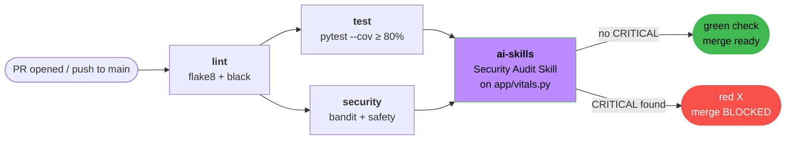

# CI Pipeline Architecture

The Week 6 CI pipeline runs on every pull request and every push to `main`.
Four jobs with explicit `needs:` ordering form a dependency DAG:
`lint → {test, security} → ai-skills`. The AI-Skill job parses the Security
Audit Skill output and exits non-zero on any `CRITICAL` finding, blocking
the merge.

Coverage and CRITICAL gates both fail the pipeline; only one needs to fire
to block merge. The PR template's checkboxes (Security, Performance,
Migrations, Feature Flags) are an additional non-automated gate.
