# Docker Architecture

Multi-stage Dockerfile (builder → runtime) plus a docker-compose stack that
adds Postgres and Redis. Two named volumes persist data across `compose down`.
The api inherits its HEALTHCHECK from the Dockerfile (urllib probe of
`/health`), so the compose file doesn't redeclare one.

```mermaid
flowchart TB
    subgraph builder[<b>Stage 1: builder</b> — python:3.11]
        direction TB
        B1[Full python:3.11 image] --> B2[pip install --prefix=/install<br/>-r requirements.txt]
        B2 --> B3[/install populated:<br/>flask, gunicorn,<br/>psycopg2-binary, redis/]
    end

    subgraph runtime[<b>Stage 2: runtime</b> — python:3.11-slim]
        direction TB
        R1[python:3.11-slim base] --> R2[ENV PYTHONDONTWRITEBYTECODE=1<br/>PYTHONUNBUFFERED=1]
        R2 --> R3[useradd appuser UID 10001]
        R3 --> R4[COPY --from=builder /install -> /usr/local]
        R4 --> R5[COPY --chown=appuser . /app]
        R5 --> R6[USER appuser]
        R6 --> R7[EXPOSE 5000]
        R7 --> R8[HEALTHCHECK<br/>urllib GET /health<br/>30s · 20s start · retries 3]
        R8 --> R9[CMD gunicorn<br/>--workers 2<br/>app:create_app&#40;&#41;]
    end

    B3 -. COPY --from=builder .-> R4

    subgraph compose[<b>docker-compose.yml</b> — local stack]
        direction LR
        API[api<br/>healthtrack:local] --> DB[(db<br/>postgres:15-alpine<br/>vol: postgres_data)]
        API --> CACHE[(cache<br/>redis:7-alpine<br/>vol: redis_data)]
    end

    runtime -. service: api .-> API

    classDef stage fill:#1f6feb,stroke:#bc8cff,color:#fff
    classDef vol fill:#3fb950,stroke:#3fb950,color:#000
    class B1,B2,B3,R1,R2,R3,R4,R5,R6,R7,R8,R9 stage
    class DB,CACHE vol
```

Image size: 236 MB (under the 300 MB rubric target). Final image carries
*only* the runtime stage's layers — the builder image and its 1 GB of
build tooling never reaches the registry.
