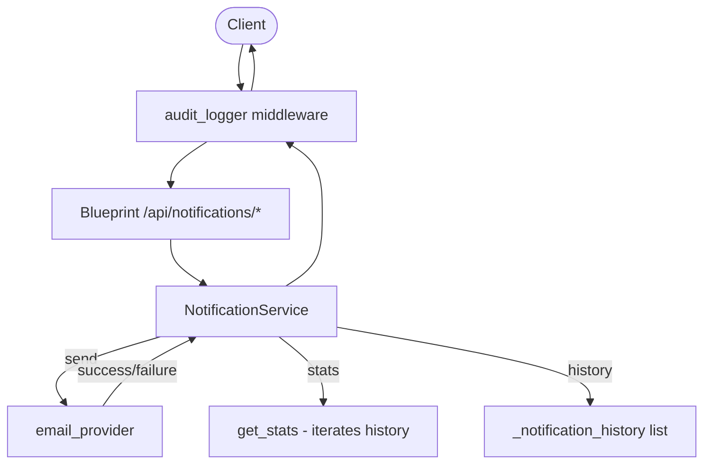

# Capstone Plan — Notification Service API

## 1. Problem Statement

The Claude Code Mastery program culminates in a capstone that demonstrates end-to-end command of the AI-augmented software development lifecycle. The vehicle is a Notification Service REST API — a Flask application that sends, retries, audits, and reports on email notifications. The scaffold ships with REQ-001 through REQ-006 fully implemented and 73 passing tests at 96% coverage.

The capstone challenge is not "build from scratch" but rather "extend, verify, document, and ship." The extension point is REQ-007: a stats endpoint (GET /api/notifications/stats) that computes aggregate metrics from the in-memory notification history. Beyond code, the capstone requires a CI coverage gate, Docker deployment validation, two Architecture Decision Records, a pre-commit governance hook with audit logging, and a formal report with ROI measurement.

This plan defines the scope, session breakdown, and success criteria for the capstone. Every session produces a PR that auto-merges into main after branch protection checks pass.

## 2. Why This Problem — Alignment with Prior Weeks

The capstone deliberately inherits techniques from every prior week:

- **Week 2 (Spec-Driven Development):** The feature_spec.yaml pattern and REQ-ID traceability in docstrings and test names carry forward. REQ-007 is specified in the same YAML schema as REQ-001 through REQ-006.
- **Week 3 (Governance Hooks):** The pre-commit hook pattern (flake8 + tests + JSONL audit log) adapts the W3 validate-bash and scope-guard hooks to a Python project context.
- **Week 4 (Audit Middleware):** The audit_logger middleware in the scaffold mirrors the W4 JSONL audit logger with SHA-256 integrity checks. The structured error handling pattern (retry_history on RuntimeError) follows W4's error-attachment approach.
- **Week 5 (Structured Agent Prompts):** The Phase 2 security review uses W5's structured finding format (File:Line, OWASP category, severity, issue, fix).
- **Week 6 (CI/CD + Docker):** The 6-stage GitHub Actions pipeline and multi-stage Dockerfile follow the W6 HealthTrack patterns directly.

## 3. Scope IN — Exact Deliverables

Per the lab brief's 100-point rubric plus 10 bonus points:

1. All tests pass (pytest -q): 15 pts
2. Coverage >= 80% (pytest --cov=src): 10 pts
3. REQ-007 endpoint works (curl /api/notifications/stats): 15 pts
4. Docker health check passes (docker-compose up + curl /api/health): 15 pts
5. Governance audit log populated (curl /api/notifications/audit): 10 pts
6. ADR-002 written (docs/adr/002-stats-computation-strategy.md): 10 pts
7. metrics-report.md updated with REQ-007 row: 10 pts
8. Pre-commit hook installed and validated: 10 pts
9. Submission notes completed (REPORT.md): 5 pts
10. Bonus: Second ADR (docs/adr/003-retry-history-on-runtime-error.md): +5 pts
11. Bonus: Docker memory limit (mem_limit: 256m): +5 pts

Total target: 110/110.

## 4. Scope OUT — Explicit Exclusions

The following are explicitly out of scope to prevent drift:

- **No database.** The service uses in-memory stores. No SQLite, PostgreSQL, or Redis.
- **No new endpoints beyond REQ-007.** The 7-endpoint API surface is fixed.
- **No real SMTP.** The email provider is a mock that returns deterministic results.
- **No modifications to week-1/ through week-6/.** Completed weeks are frozen.
- **No regeneration of Mini Project 1-6 PDFs.** Submission PDFs are frozen.
- **No fix for the MP5 mermaid rendering issue.** That is a known PDF pipeline artifact, not a capstone deliverable.
- **No new pip packages.** requirements.txt is fixed.
- **No W7 dashboard "complete" flip until Session E.** The status dot progression (upcoming → in-progress → complete) is intentional.

## 5. Architecture Sketch

The Notification Service is a single Flask application with four layers:

- **Routes layer** (`src/routes/notifications.py`): Blueprint with 7 endpoints under /api/
- **Service layer** (`src/notifications/notification_service.py`): Business logic — validate, send with retry, record history, compute stats
- **Provider layer** (`src/notifications/email_provider.py`): Pluggable email adapter (mock in dev/test, real in prod)
- **Middleware layer** (`src/middleware/audit_logger.py`): Before/after request hooks that log every API call

The stats path (REQ-007) is a read-only operation that iterates the bounded history list (max 100 records) and returns aggregated counts. It does not write to the history or trigger the email provider.

## 6. Integration with Prior Weeks

| Prior Week | Technique Reused | Where It Shows Up |
|------------|------------------|-------------------|
| W2 | Spec-driven YAML + REQ-ID traceability | feature_spec.yaml REQ-007, docstrings with REQ-IDs |
| W2 | REQ-ID comments in code | get_stats() docstring cites REQ-007 |
| W3 | Pre-commit hook pattern | .git/hooks/pre-commit adapted from W3 validate-bash |
| W3 | JSONL audit log schema | .audit-log.jsonl written by hook, same schema as W3 |
| W4 | Audit middleware pattern | src/middleware/audit_logger.py before/after request |
| W5 | Structured agent prompts | Phase 2 security review findings format |
| W6 | Multi-stage Dockerfile | Dockerfile with builder + runtime stages |
| W6 | GitHub Actions CI structure | .github/workflows/ci.yml 6-stage pipeline |

## 7. Session Plan

| Session | Branch | Deliverable | Verification Gate |
|---------|--------|-------------|-------------------|
| **A** | week-7/session-a | Scaffold drop, CAPSTONE_PLAN.md, README.md, REQ-007 spec added to feature_spec.yaml, REQ-007 implementation verified live, dashboard W7 flipped to in-progress with mermaidRenderedW7 plumbing, CLAUDE.md staleness fix | pytest 73 pass, curl /stats returns 200, security scan clean |
| **B** | week-7/session-b | REQ-007 test classes verified (unit TestStats 5 cases, integration TestStats 5 cases, regression TestStatsResilience 2 cases), CI coverage gate verified/documented | All tests pass, coverage >= 80%, flake8 clean |
| **C** | week-7/session-c | Docker live validation (all 7 endpoints), ADR-002, ADR-003 (bonus), metrics-report.md updated, pre-commit hook installed with audit log, docker-compose mem_limit (bonus) | Docker healthy, all endpoints return expected codes, hook fires on trial commit |
| **D** | week-7/session-d | REPORT.md (4 submission notes, rubric self-assessment, ROI table, demo checklist), dashboard mini-project panel fully populated with Mermaid diagrams, "View on GitHub" button | REPORT.md complete, no TBD placeholders, mermaid divs render |
| **E** | week-7/session-e | Submission PDF at repo root, W7 status dot flipped to complete, final dashboard verification | PDF exists, pdftotext confirms no mermaid rendering artifacts, dashboard shows green W7 |

## 8. Risk Register

| # | Risk | Likelihood | Impact | Mitigation |
|---|------|------------|--------|------------|
| 1 | **REQ-007 already in scaffold** — could appear as if no implementation work was done | High | Medium | Reframe as verification of AI-generated implementation. Document equivalent prompts that would produce the same code. The security review and ADR are the original intellectual contributions. |
| 2 | **MP5 mermaid PDF bug could recur in MP7** — the W5 submission PDF had broken mermaid rendering (black squares instead of diagrams) | Medium | High | Reuse the W3/W4/W6 working pipeline in Session E. Verify with `pdftotext ... \| grep -c "■"` before committing. If rendering fails, fall back to pre-rendered PNG screenshots embedded in the PDF source. |
| 3 | **Branch protection blocks intermediate work** — main requires PR + checks | Certain | Low | One PR per session with auto-merge. Each session is self-contained with its own verification gates. If a PR blocks, diagnose via `gh pr checks` before starting the next session. |

## 9. Demo Plan

The lab brief specifies 10 demo items. All are in scope:

1. Health check live (curl /api/health → 200)
2. Send welcome notification (POST /send → 200 + message_id)
3. Send to fail@test.com (retry + 500 with retry_history)
4. Validation error (POST /send missing "to" → 400)
5. Notification history with status filter (GET /notifications?status=success)
6. Governance audit log (GET /notifications/audit → 200)
7. REQ-007 stats endpoint (GET /notifications/stats → 200 with total, by_type, by_status, last_sent)
8. Pre-commit hook output (trial commit fires hook + writes .audit-log.jsonl)
9. CI pipeline stages documented (6 jobs in ci.yml)
10. Docker health check (docker inspect shows healthy)

## 10. Success Criteria

| # | Rubric Item | Points | Verification Command |
|---|-------------|--------|---------------------|
| 1 | All tests pass | 15 | `pytest -q` |
| 2 | Coverage >= 80% | 10 | `pytest --cov=src --cov-fail-under=80` |
| 3 | REQ-007 endpoint works | 15 | `curl http://localhost:5000/api/notifications/stats` |
| 4 | Docker health check passes | 15 | `docker-compose up -d && docker inspect --format='{{.State.Health.Status}}'` |
| 5 | Governance audit log populated | 10 | `curl http://localhost:5000/api/notifications/audit` |
| 6 | ADR-002 written | 10 | `ls docs/adr/002-stats-computation-strategy.md` |
| 7 | metrics-report.md updated | 10 | `grep REQ-007 docs/metrics-report.md` |
| 8 | Pre-commit hook installed | 10 | `ls .git/hooks/pre-commit && git commit --allow-empty -m "test"` |
| 9 | Submission notes completed | 5 | `cat week-7/REPORT.md` |
| **Subtotal** | | **100** | |
| 10 | Bonus: Second ADR | +5 | `ls docs/adr/003-retry-history-on-runtime-error.md` |
| 11 | Bonus: Docker memory limit | +5 | `grep mem_limit docker-compose.yml` |
| **Total** | | **110** | |
